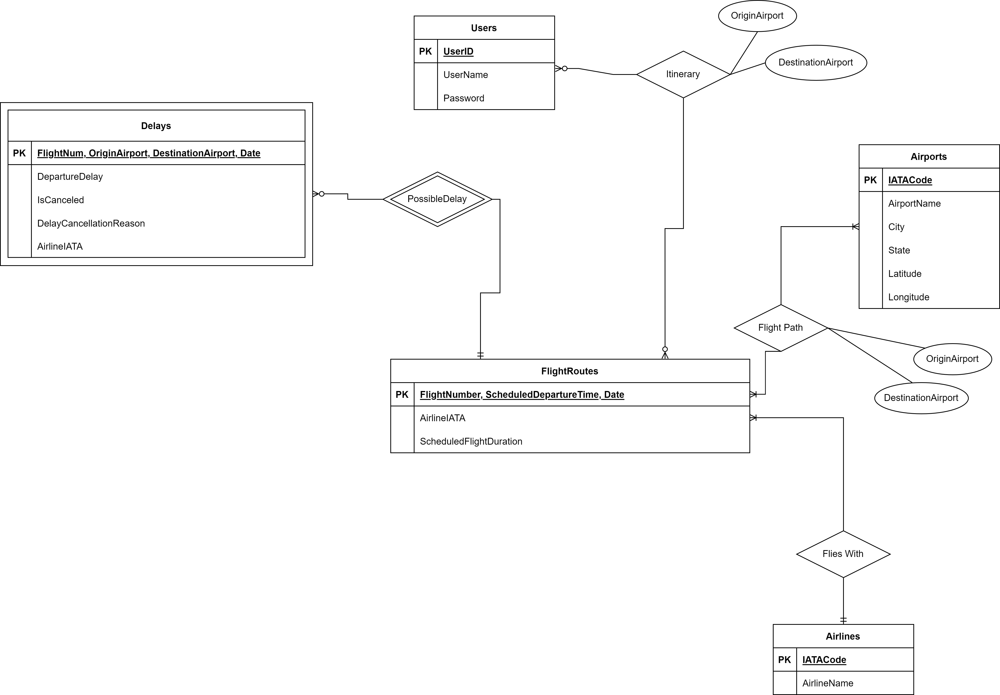

# ER Diagram, Assumptions + Relationships, and Relational Schema
### ER Diagram


### Assumptions
- Assuming every airport has a working runway, has arrival and departure flights 
- Assuming not every user will be flying so not every user has an itinerary 
- Assuming every flight belongs to an airline 
- Assuming each flight can only go on one route at a time, but a route may be traversed multiple times in the same day, so flight will be unique based on flight number and date and time (primary keys for routes)
- Connecting flights from destination A to B to C will be treated as a single route from A to B and another route from B to C, users will only be able to report a delay on a given single leg of their journey at one time. If the route from A to B is delayed, that delay will not carry over to the route B to C. 
- Assuming all NULL cancellation/delay reasons are undefined or unknown 
- We will not be handling flights that were diverted, the data will be cleaned to only include direct flights 
- Our dataset only handles flights and routes within USA 
- All airlines are represented by at least one flight route
- All itineraries MUST be linked to ONLY ONE User, but a User can have multiple itineraries 
- If a flight route for a given time and date gets additional delays and/or is canceled, the existing delay record will be updated. A new record will not be made for any additional delays and/or in the event of cancellation
- Itineraries should never be empty (there is always only one flight for a user), if a user has multiple flights booked, each is represented by a separate itinerary. 

### Relationships & Cardinality
- Itinerary: User to FlightRoutes, FlightRoutes to User
  - This relationship is 0 to many optional because:
    - Not every user in our database will have a flight booked, i.e. no itinerary for that user at the moment, but a user in the database may also have multiple flights booked, i.e. multiple itineraries for that user. 
    - Not every valid flight route will have a user in our database taking that route, i.e. no itinerary for that flight out at the moment, but a flight route in the database may also have multiple users taking that route, i.e. multiple itineraries for that flight route. 
- PossibleDelay: FlightRoutes to Delays
  - This relationship is zero to many because a Flight Route may not have a delay, or it may have many. 
- PossibleDelay: Delays to FlightRoutes
  - This relationship is mandatory because if a delay exists it must be associated with exactly one flight route schedule. We will also add a constraint on this to make sure the validity of reported delays. 
- Flies With: FlightRoutes to Airlines
  - This relationship is 1 to many because a flight route must be associated with only one airline. 
- Flies With: Airlines to FlightRoutes
  - This relationship is 1 to many because an airline can have one to many flight routes since a given airline can be in one or multiple flights
- Flies Path: FlightRoutes to Airports
  - This relationship is 1 to many because a plane’s route goes through at least 2 different airports: origin and destination airports.
- Flies Path: Airports to FlightRoutes
  - This relationship is 1 to many since all airports must be included in the given flight routes, but can be included at least once among all flight routes. 

### Relational Schema
```
Users (
  UserID: INT [PK],
  UserName: VARCHAR(100), 
  Password: VARCHAR(100)
)
```
```
Itinerary (
  UserID: INT [PK] [FK to Users.UserID],
  FlightNum: INT [PK] [FK to FlightRoutes.FlightNumber],
  Date: DATE [PK] [FK to FlightRoutes.Date],
  ScheduledDepartureTime: TIME [PK] [FK to FlightRoutes.ScheduledDepartureTime],
  OriginAirportIATACode: VARCHAR(3) [FK to Airports.IATA],
  DestinationAirportIATACode: VARCHAR(100) [FK to Airports.IATA]
)
```
```
Delays (
  FlightNum: INT [PK] [FK to FlightRoutes.FlightNumber],
  Date: DATE [PK] [FK to FlightRoutes.Date],
  ScheduledDepartureTime: TIME [PK] [FK to FlightRoutes.ScheduledDepartureTime],
  DestinationAirportIATACode: VARCHAR(3) [PK] [FK to Airports.IATA],
  OriginAirportIATACode: VARCHAR(3) [PK] [FK to Airports.IATA],
  DepartureDelay: TIME,
  IsCanceled: BOOL,
  DelayCancellationReason: VARCHAR(100),
  AirlineIATA: VARCHAR(3) [FK to Airlines.IATACode]
)
```
```
Airports (
  IATACode: VARCHAR(3) [PK],
  AirportName: VARCHAR(255),
  City: VARCHAR(255),
  State: VARCHAR(255),
  Latitude: REAL,
  Longitude: REAL
)
```
```
Airlines (
  IATACode: VARCHAR(2) [PK],
  Airline: VARCHAR(255)
)
```
```
FlightRoutes (
  FlightNumber: INT [PK],
  ScheduledDepartureTime: TIME [PK],
  Date: DATE [PK],
  AirlineIATA: VARCHAR(2) [FK to Airlines.IATACode],
  ScheduledFlightDuration: INT
)
```
```
FlightPath (
  FlightNumber: INT [PK] [FK to FlightRoutes.FlightNumber],
  ScheduledDepartureTime: TIME [PK] [FK to FlightRoutes.ScheduledDepartureTime],
  Date: DATE [PK] [FK to FligthRoutes.Date],
  OriginAirportIATACode: VARCHAR(3) [PK] [FK to Airports.IATACode],
  DestinationAirportIATACode: VARCHAR(3) [PK] [FK to Airports.IATACode]
)
```
