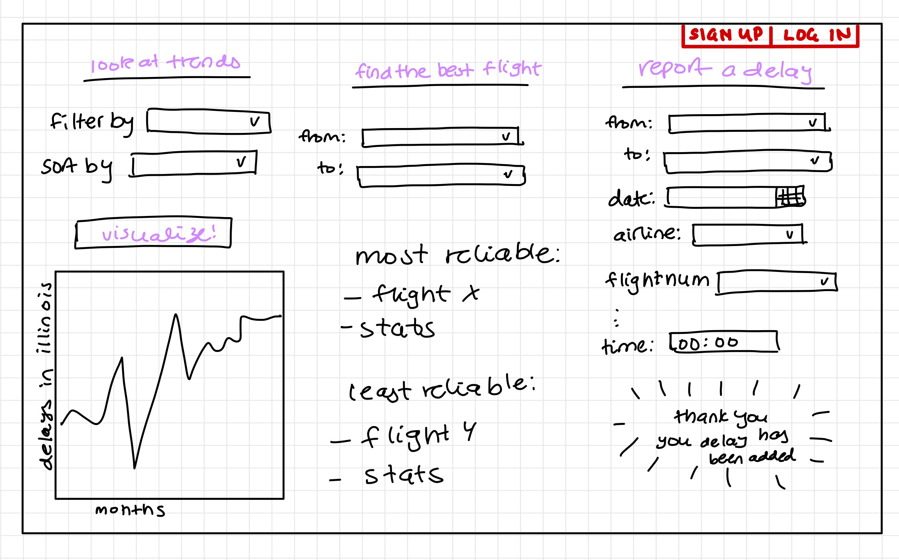

# NoMorDelays
### Project Summary
We are storing flight delay and cancellation information in our database, starting with information from the year 2015. The primary information includes flight number, origin airport, destination airport, scheduled time of departure, airline, delay time, and/or if the flight was canceled. Simple features will provide useful information to the users on what flights are most reliable for their journey from one location to another during a certain time of year. Complex features will allow users to update our database with flight delays and cancellations they themselves are experiencing. 

### Description
Our application will help users determine where and when the highest chance of a delay will happen. This allows the users to plan out their flight travels accordingly so that they avoid as much delay as possible. It can also simplify the airline/airport search process for users since our application will find the most reliable airlines and airports that have the lowest chances of delay for the users’ flight path. 

The application’s real-time feature provides users with access to a constant and continuous stream of data, allowing them to understand what is occurring in airports around America and then take that into account when planning their flights. By aggregating all of the flight details, data visualizations can be built to provide users with a rough outline of airports’ past histories with flight delays. 

### Usefulness
Our application is useful because it can allow users to know timely whether or not there is a delay in their flight, facilitating travelers the time to consider other transportation options and what steps to take as a result of the delay. Additionally, our application ensures its real-time accuracy by allowing users to add or remove data from the database, confirming or disproving the information presented in our application. Our application will also find the most reliable flight options and airport locations that have the lowest chances of delay for each user’s flight path. This allows for more time-efficient traveling, as users can feel more secure that they can avoid the most probable locations where delays will occur. 

There are many existent applications that already track flight delays, such as FlightAware Flight Tracker, ID90 Travel, Flighty, or Planes Live. However, our application is different from theirs in that our data can be contributed by users. Users can add delays through our website to ensure the most up-to-date information and other users can view this information. If a delay report is inaccurate, users can also report the problem and request to have the false information removed from our database.

### Realness
Using Kaggle, an online freely accessible platform that hosts an abundance of datasets with varying characteristics and features, our team will use a dataset specific to flight delays and cancellations. Containing information on all 2015 flight delays and cancellations within and across the United States, this dataset comes directly from the U.S. Department of Transportation's Bureau of Transportation Statistics. 

With information on specific airlines, airports, and flights, this specific dataset provides an abundance of information ranging from features like flight distance and air time to features as specific as the duration of taxi and reason for flight delay. By building a user interface, a user can then add on to this dataset if their own flight experience was delayed or canceled. Thus in its final form, this data set will be a conglomerate of both 2015 and current flights, presenting opportunities for historical and real-time analysis. 

### Functionality
Our techstack will consist of a React frontend and Flask backend. Our data will be stored in a MySQL database hosted on Google Cloud Platform (GCP).

Our website will feature a dashboard layout, where the user will be able to enter/filter by certain fields and names to retrieve delay and cancellation data for their needs. The user will also be able to add or update new delays/cancellations that they have just experienced to help with the overall average delay for that airline or airport. If there was a typo or false entry, the user or any other user can also remove a specific entry from the database. 

One of our stretch goals is to provide user authentication by allowing users to create an account which will be stored in our database. This would require users to log in to gain access to use and add to our database. This ensures that only validated users are able to modify our database, increasing the security and reliability of our application. 

### Low-Fidelity UI Mockup

### Project Work Distribution
- Gagan: Will handle most of the frontend and help with database creation

- Lasya: Help with backend 

- Joy: Help with the frontend and creation of ER diagram

- Daniel: Help with backend and handle deployment of the database to GCP
